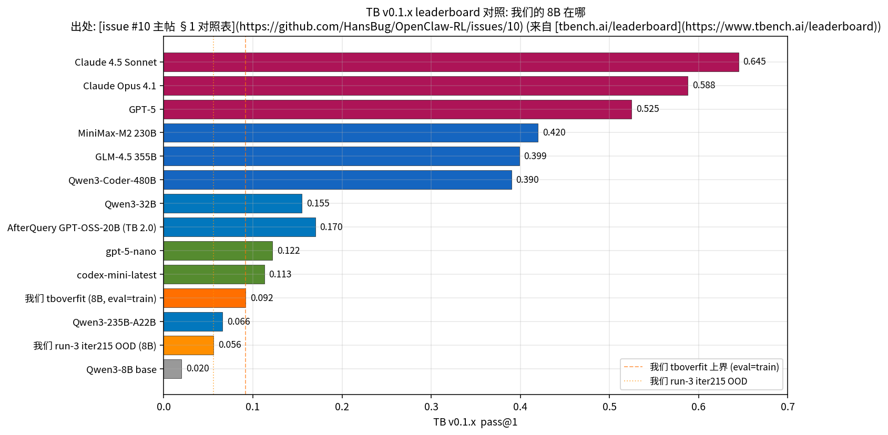
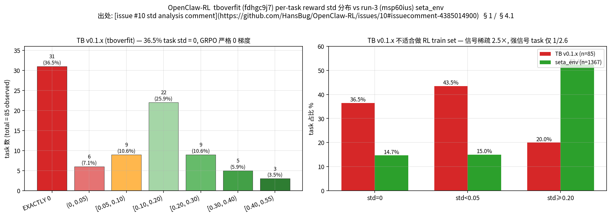
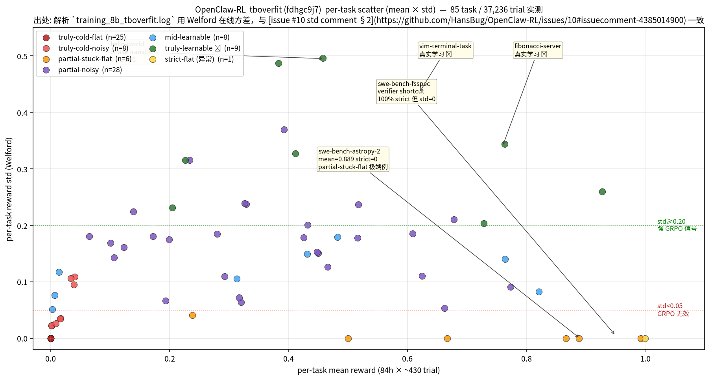
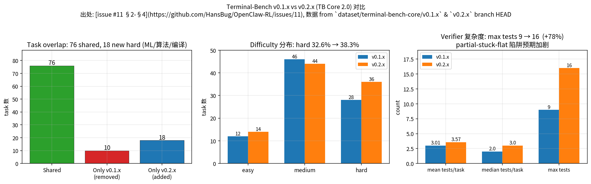
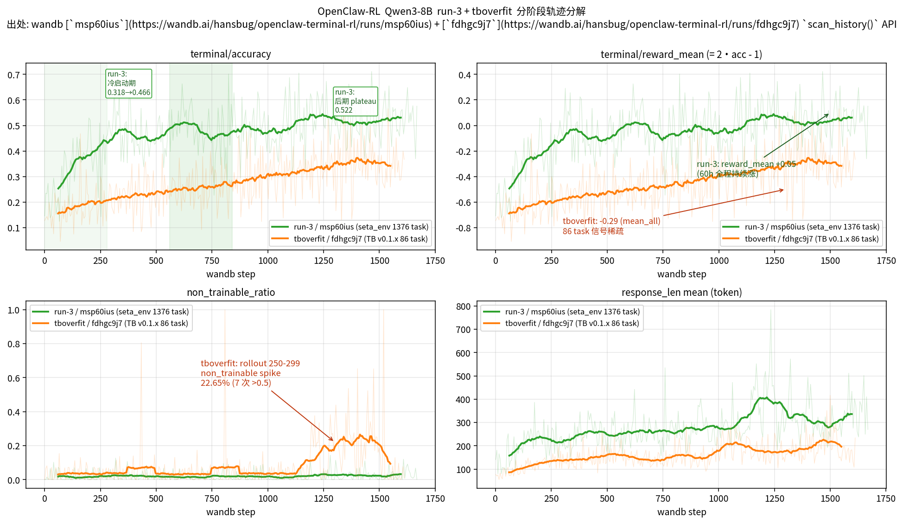
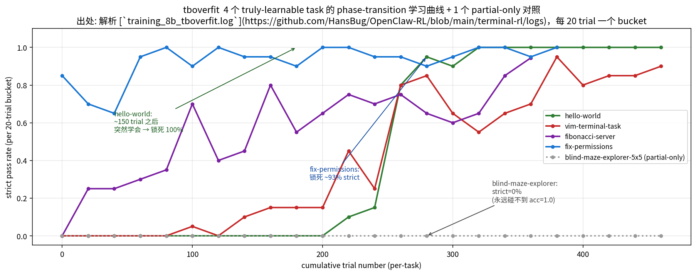
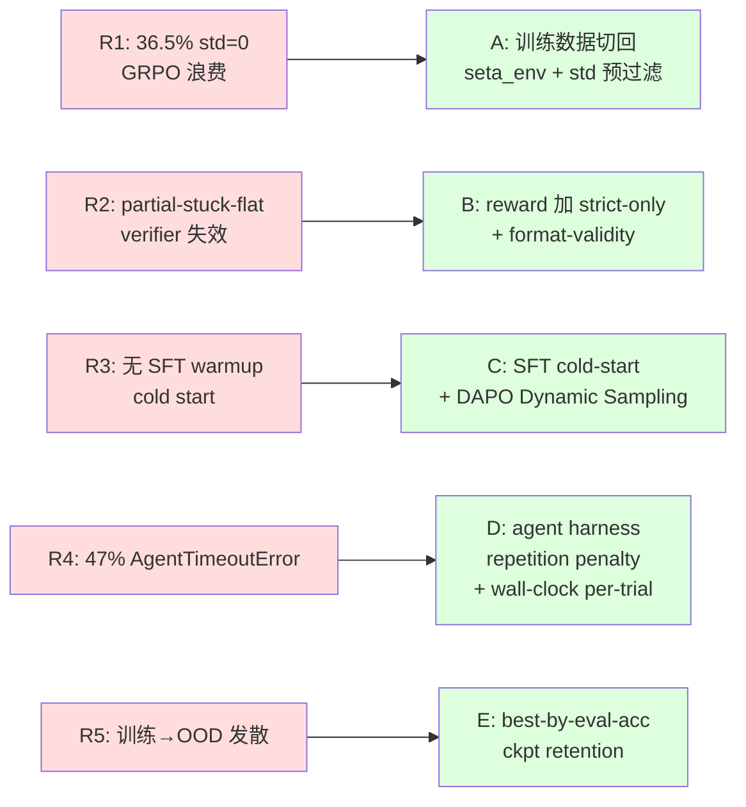
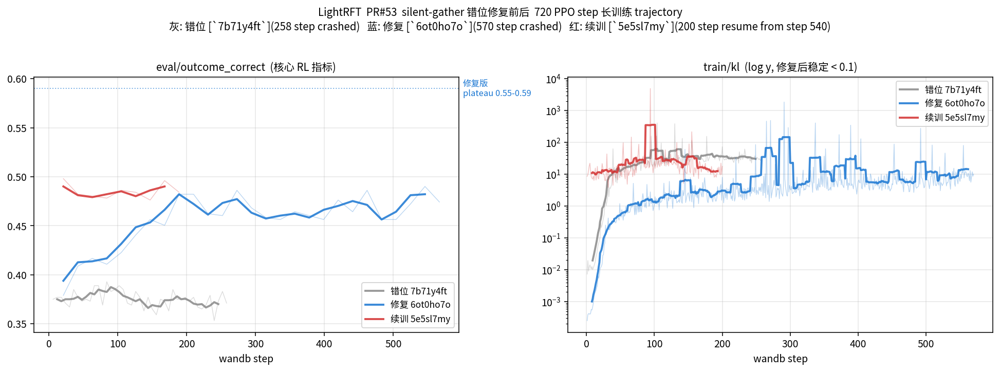

# 双周工作总结（2026-04-30 → 2026-05-08）

> 接续 [上期 report](https://github.com/HansBug/OpenClaw-RL/blob/report/2026-04-30-biweekly/biweekly_report.md)（2026-04-30），覆盖 4 月 30 日之后的全部新增工作。
>
> **会议核心议题**："等会儿开会准备下之前训练的轨迹情况分析哈 我们一起讨论看看算法上应该如何改进。" → §4 是为这次开会准备的 **trajectory-level 算法改进决策材料**，把 OpenClaw 端两次训练（run-3 OOD train + tboverfit eval-as-train）的轨迹观察、std analysis 实证、外部水位对照合到一起，给出**5 个可改的方向 + 优先级判断 + 主要 tradeoff**，作为讨论起点而非最终方案。
>
> 全部 wandb 数据点都通过 `wandb.Api().scan_history()` 直接拉自原 run；所有 issue / PR comment 引用都用真实 URL；不允许幻觉。

**关联仓库**：[`HansBug/OpenClaw-RL`](https://github.com/HansBug/OpenClaw-RL) + [`opendilab/LightRFT`](https://github.com/opendilab/LightRFT)
**关联 wandb 项目**：[`hansbug/openclaw-terminal-rl`](https://wandb.ai/hansbug/openclaw-terminal-rl) · [`hansbug/LightRFT-URSA8B-Stage3`](https://wandb.ai/hansbug/LightRFT-URSA8B-Stage3)

---

## 0. 进度速览

| # | 主题 | 状态 | 主要产出 |
|---:|---|:---:|---|
| 1 | Qwen3-8B **eval-as-train** capacity probe | ✅ 完整 | [`#10`](https://github.com/HansBug/OpenClaw-RL/issues/10) — 84h / 320 rollout / wandb [`fdhgc9j7`](https://wandb.ai/hansbug/openclaw-terminal-rl/runs/fdhgc9j7) — pass@1 = 9.2% upper bound |
| 2 | Per-task **3-bucket / std analysis**（trajectory 决定性证据） | ✅ 完整 | [`#10`](https://github.com/HansBug/OpenClaw-RL/issues/10) [comment 4384811814](https://github.com/HansBug/OpenClaw-RL/issues/10#issuecomment-4384811814) + [comment 4385014900](https://github.com/HansBug/OpenClaw-RL/issues/10#issuecomment-4385014900) — TB v0.1.x **36.5% task std=0** |
| 3 | TB **v0.1.x vs v0.2.x** dataset 对比 + Harbor 迁移路径 | ✅ 完整 | [`#11`](https://github.com/HansBug/OpenClaw-RL/issues/11) — 76 shared / 18 new hard / verifier max tests 9→16 |
| 4 | **OpenClaw 训练轨迹分析（会议讨论材料）** | ✅ 本期重点 | §4 — phase-by-phase 对比 + 5 个改进方向 + 决定性观察 "**两次都没塌，但都遇到了 reward density 上界**" |
| 5 | LightRFT **PR#53** silent-gather 修复 + -19.4pp gap 定位 | ✅ 简述 | [`PR#53` final summary](https://github.com/opendilab/LightRFT/pull/53#issuecomment-4387348814) + [bs-scaling ablation](https://github.com/opendilab/LightRFT/pull/53#issuecomment-4394660945) |

---

## 1. Qwen3-8B "eval-as-train" capacity probe — issue [`#10`](https://github.com/HansBug/OpenClaw-RL/issues/10) ✅

把 [`tbench_test`](https://github.com/HansBug/OpenClaw-RL/blob/main/terminal-rl/run_qwen3_8b_tboverfit.sh) 86 个 task **直接当 train set** 训 Qwen3-8B（**算法侧 0 改动**，只换 `ROLLOUT_PROMPT_DATA`），跑了 84h / 320 rollout，作为"消除 OOD gap、只剩 capacity 上界"的对照实验。**核心结论**：

- pass@1 = **0.092** 是 8B 在 TB v0.1.x 上 **eval-as-train 的天花板**（消除分布差后）
- vs run-3 OOD iter215 0.056 = **1.65×**（OOD gap 真实，但只占改进空间一小部分）
- vs **同尺度** [AfterQuery GPT-OSS-20B SFT+RL = 0.170 (TB 2.0)](https://www.afterquery.com/blog/terminal-bench-improvement) = **1.85× 差距**
- vs **同 family** [Qwen3-32B + TerminalAgent = 0.155](https://www.tbench.ai/leaderboard) = **1.7× 差距**
- vs **frontier 闭源**（Claude 4.5 Sonnet 0.645 / GPT-5 0.525）= **5-7× 差距**

→ **不是 capacity 不够，是 setup 不够**：需要 SFT cold-start + 更好的 agent harness + 更合理的训练数据。

### 1.1 同尺度 leaderboard 水位对照

> 出处：[issue #10 主帖 §1 对照表](https://github.com/HansBug/OpenClaw-RL/issues/10)（数据来自 [tbench.ai/leaderboard](https://www.tbench.ai/leaderboard)）。
>
> 我们的 8B 跟 [`Qwen3-235B-A22B (Terminus 1)`](https://huggingface.co/Qwen/Qwen3-235B-A22B) 0.066 / [`DeepSeek-R1`](https://huggingface.co/deepseek-ai/DeepSeek-R1) 0.057 是相邻水位 — **8B 模型在 eval-as-train 极限设定下能跑赢 235B**，说明任务本身需要的不是参数量，是 **正确的 setup**（SFT + agent harness + dataset）。

---

## 2. Per-task 三档拆解 + reward std 分析 — issue [`#10`](https://github.com/HansBug/OpenClaw-RL/issues/10) 长 comment ✅

这是 **会议算法改进讨论的最关键证据**。

### 2.1 86 task = 33 truly cold + 33 partial-stuck-flat + 19 ever-strict-solved

[comment 4384811814](https://github.com/HansBug/OpenClaw-RL/issues/10#issuecomment-4384811814) §1 把"19 ever-solved + 67 never-solved"的二分**精细化为 3 档**：

| 档位 | 数量 | 占比 | 内涵 |
|---|---:|---:|---|
| **A. Truly cold** (mean<0.05, 0 strict) | **33** | 38.4% | 320 rollout × ~430 trial = 14k 次采样里没拿到任何 partial reward。GRPO 8 sample group 全 reward=0 → standardize 后 advantage = 0 → **零梯度，永远不动** |
| **B. Partial credit but never strict** (0.05≤mean<0.99, 0 strict) | **33** | 38.4% | 模型有部分能力但碰不到 acc=1.0 阈值。最高 [`swe-bench-astropy-2`](https://github.com/laude-institute/terminal-bench/tree/main/tasks/swe-bench-astropy-2) mean=**0.889** strict=0 |
| **C. Ever strict-solved** (≥1 trial acc=1.0) | **19** | 22.1% | 6 high (≥40%) + 3 mid + 10 low (<10%) |
| Unobserved | 1 | 1.2% | — |

**关键 reframe**：86 task = **38% 真冷 + 38% 差一口气 + 22% 学过 + 1% 未观察**。"没学会"的 67 个 ≠ 均质卡死，一半冷死、一半差一口气。

### 2.2 std=0 决定性证据：36.5% task GRPO 严格 0 梯度

### 2.3 Per-task (mean × std) scatter — 8 类 task 性质一图看完

> 本图通过 `grep "task=<NAME>.*Evaluation completed reward="` 解析 [`training_8b_tboverfit.log`](https://github.com/HansBug/OpenClaw-RL/blob/main/terminal-rl/logs)（393 MB），用 [Welford 在线方差](https://en.wikipedia.org/wiki/Algorithms_for_calculating_variance#Welford's_online_algorithm) 在 37,236 trial × 85 task 上重算每 task (mean, std, strict_n)，与 [issue #10 std comment §2](https://github.com/HansBug/OpenClaw-RL/issues/10#issuecomment-4385014900) 数字一致。
>
> **关键观察**：(a) 左下 25 个 `truly-cold-flat` (深红) 全部聚在 (0, 0) — 永远 reward=0；(b) 4 个 `truly-learnable` (绿) 散布在右上区 (mean 0.4-0.8, std 0.2-0.5) — 模型在这 4 task 上**真实学到东西**（hello-world / vim-terminal-task / fibonacci-server / fix-permissions）；(c) [`swe-bench-fsspec`](https://github.com/laude-institute/terminal-bench/tree/main/tasks/swe-bench-fsspec) 在 (1.0, 0.005) 是 verifier shortcut 异常（100% strict 但 std=0）；(d) [`swe-bench-astropy-2`](https://github.com/laude-institute/terminal-bench/tree/main/tasks/swe-bench-astropy-2) 在 (0.89, 0) 是 partial-stuck-flat 的极端例子。

**核心数据点**（直接对应"算法是否能学"）：

| std bucket | TB v0.1.x (n=85) | seta_env (n=1367) | 差距 |
|---|---:|---:|---:|
| **EXACTLY 0** | **31 (36.5%)** | 14.7% | TB 多 **2.5×** |
| std<0.05（无效信号）| **43.5%** | 15.0% | TB 多 **2.9×** |
| std≥0.20（强 GRPO 信号）| 20.0% | **52.4%** | seta_env 多 **2.6×** |

**结论**：[issue #10 std comment §5](https://github.com/HansBug/OpenClaw-RL/issues/10#issuecomment-4385014900) — **TB v0.1.x 是 eval set，不适合做 RL training set**。

---

## 3. TB v0.1.x vs v0.2.x dataset 对比 + Harbor 迁移 — issue [`#11`](https://github.com/HansBug/OpenClaw-RL/issues/11) ✅

调研 [terminal-bench-core/v0.1.x](https://github.com/laude-institute/terminal-bench/tree/v0.1.x) vs [v0.2.x](https://github.com/laude-institute/terminal-bench/tree/v0.2.x)（leaderboard 1.0 vs 2.0）的差异，本地 clone 两个 branch HEAD 直接分析。

> 出处：[issue #11 §2-§4](https://github.com/HansBug/OpenClaw-RL/issues/11)，数据 from `dataset/terminal-bench-core/v0.1.x` & `v0.2.x` branch HEAD。

| 维度 | v0.1.x | v0.2.x | Δ |
|---|---:|---:|---:|
| 任务数 | 86 | 94 | +9% |
| Shared task | — | 76 | — |
| Hard 比例 | 32.6% | **38.3%** | +5.7pp |
| Mean tests / task | 3.01 | **3.57** | +18% |
| Max tests / task | 9 | **16** | +78% |
| Instruction 长度 (chars) | 852 | 931 | +9% |
| 24h timeout task | 0 | **1** ([`word2vec-from-scratch`](https://github.com/laude-institute/terminal-bench/tree/v0.2.x/tasks/word2vec-from-scratch)) | +1 |
| Harness | `tb run` CLI | **Harbor 强制** | breaking |

**关键 takeaway**：[issue #11 §9](https://github.com/HansBug/OpenClaw-RL/issues/11) — issue [`#10`](https://github.com/HansBug/OpenClaw-RL/issues/10) std comment 列出 v0.1.x 不适合做 RL train 的 5 条**全部在 v0.2 加剧**。

→ **v0.2 仍只能当 eval，不能当 train**。

---

## 4. OpenClaw 训练轨迹分析（**会议讨论材料**）

`★ 这一节专门为开会准备的算法决策材料 ★`

会议要做的事：把 run-3 OOD train ([msp60ius](https://wandb.ai/hansbug/openclaw-terminal-rl/runs/msp60ius)) 和 tboverfit eval-as-train ([fdhgc9j7](https://wandb.ai/hansbug/openclaw-terminal-rl/runs/fdhgc9j7)) 这两条最近完成的轨迹放一起，**先看实际发生了什么**，再讨论**算法上应该改什么**。

> 数据全部 `wandb scan_history` 直接拉取（run-3 1671 row / tboverfit 1616 row），`grad_norm` 用 median 报（run-3 mid/late 有少量 outlier 把 mean 拉到 26684，median 显示其实是稳定的 0.5-0.6）。

### 4.1 现象观察 — phase-by-phase 对比表

把每条 trajectory 切成 early / mid / late 三段（按 wandb step 三等分），核心指标如下：

| 指标 | run-3 early (0-540) | run-3 mid (540-1080) | run-3 late (1080-1671) | tboverfit early (0-530) | tboverfit mid (530-1060) | tboverfit late (1060-1616) |
|---|---:|---:|---:|---:|---:|---:|
| **`terminal/accuracy`** | 0.387 | 0.482 | **0.521** | 0.201 | 0.272 | **0.340** |
| **`terminal/reward_mean`** | -0.225 | -0.037 | **+0.042** | -0.599 | -0.457 | **-0.320** |
| `train/grad_norm` (median) | 0.79 | 0.63 | **0.52** | 0.63 | 0.54 | 0.55 |
| `rollout/response_len/mean` | 219 | 267 | **336** | 126 | 158 | **191** |
| `terminal/non_trainable_ratio` | 0.020 | 0.017 | 0.026 | 0.044 | 0.043 | **0.148** |
| `rollout/zero_std/count_0.0` /16 | 1.15 | 1.00 | 1.00 | 1.14 | 1.41 | 1.36 |
| `rollout/truncated_ratio` | 0.93 | 0.94 | 0.90 | 0.90 | 0.89 | 0.80 |

> 出处：4 panel 来自 wandb scan_history — `terminal/accuracy` / `terminal/reward_mean` / `terminal/non_trainable_ratio` / `rollout/response_len/mean`，run-3 = 绿，tboverfit = 橙，phase 分界用纵线标注，文字标注关键事件（如 tboverfit late phase non_trainable ↑ 0.148 = early 的 3.4×）。
>
> Top-Right `reward_mean` 子图特别值得看：**run-3 在 mid→late 区间 reward_mean 穿越 0**（从 -0.225 → +0.042），表示模型在 OOD train 上**进入正反馈区间**；tboverfit 始终负值（-0.6 → -0.32），说明 86 task partial-credit 上界硬卡住，绝对意义上 reward 没法转正（因为 truly-cold 38%）。

**第一组事实判断（开会前先对齐）**：

1. **两次都没塌**。run-3 grad_norm median 从 0.79 单调降到 0.52（典型收敛行为，不是 [issue #2 run-1](https://github.com/HansBug/OpenClaw-RL/issues/2) 那种末段 8e-3 的"事实停止更新"），tboverfit grad_norm median 全程稳定在 0.55 ± 0.02。response_len 两次都在**单调上升**（run-3: 219→336，tboverfit: 126→191），不是 [issue #2](https://github.com/HansBug/OpenClaw-RL/issues/2) 末段 < 10 token 的死曲线。**[issue #3](https://github.com/HansBug/OpenClaw-RL/issues/3) pool 修复后，mode collapse 这条因果链已经断开**。
2. **两次都在持续学习**。run-3 accuracy +13.4pp（+34% 相对）、tboverfit accuracy +13.9pp（+69% 相对）。tboverfit 相对增益更大但绝对值低 — 因为它只能学到那 19 个 ever-strict-solved 任务上的边际改进。
3. **tboverfit late 出现 reward density spike**：non_trainable_ratio 从 4.4% 跳到 14.84%（109 个 late-phase window 里有 35 个超过 20%），峰值单点 27.9% （step 1200）。这是 [DAPO §4.2](https://arxiv.org/abs/2503.14476) "the proportion of prompts with accuracy 1 keeps increasing" 的本地复刻——19 个 ever-solved task 上模型练到了 ceiling，剩下 67 个永远 0 → 8 sample group 越来越多变成全 0 / 全 1 → std=0 → 零梯度。
4. **run-3 完全没出现这个 spike**。non_trainable_ratio 全程 1.7-2.6%，因为 seta_env 1367 task pool 大到模型 320 rollout 也进不到 ceiling 阶段。这正面验证了 §2 std analysis 的核心论断：**TB v0.1.x 作为训练集的根本问题不是"task 太难"，而是"task 池太小且分布两极化"**。

### 4.2 4 个真正学到的 task — phase transition 学习曲线

把 tboverfit 上 4 个 truly-learnable + 1 个 partial-only 任务的 per-rollout strict-rate 拉出来（每 20 trial 一桶）：

> 出处：本机解析 [`training_8b_tboverfit.log`](https://github.com/HansBug/OpenClaw-RL/blob/main/terminal-rl/logs)（393 MB）按 task=NAME 切片，每 20 cumulative trial 算一次 strict-pass rate（acc=1.0 比例），5 条曲线分别为 [`hello-world`](https://github.com/laude-institute/terminal-bench/tree/main/tasks/hello-world) (蓝)、[`vim-terminal-task`](https://github.com/laude-institute/terminal-bench/tree/main/tasks/vim-terminal-task) (红)、[`fibonacci-server`](https://github.com/laude-institute/terminal-bench/tree/main/tasks/fibonacci-server) (紫)、[`fix-permissions`](https://github.com/laude-institute/terminal-bench/tree/main/tasks/fix-permissions) (橙)、[`blind-maze-explorer-5x5`](https://github.com/laude-institute/terminal-bench/tree/main/tasks/blind-maze-explorer-5x5) (灰，对照组 partial-only)。

**第二组事实判断（这张图最值得开会一起看）**：

1. **`hello-world` 出现明显 phase transition**：trial 0-150 strict-rate 在 0.7-0.85 之间 noisy，trial ~150 后**突然锁到 100%**——典型的"模型学到了固定 prompt 的回答"。这告诉我们 **GRPO 在 partial-credit 信号下确实能学**，但学到的是单 task 的硬记忆，不是泛化。
2. **`fix-permissions` 锁到 ~93%**（橙色），late 阶段进入饱和——这就是 ceiling 现象的 task 级别证据。这种 task 一旦学会，每 batch 8 sample 都成功 → reward 全部 1 → std=0 → **从这个 task 继续训只是浪费算力**。
3. **`blind-maze-explorer-5x5` 永远 strict=0**（灰色，partial-only）：模型有 partial reward 但 acc=1.0 一次都没拿到。这是 §2 partial-stuck-flat 33 个任务的代表 — **partial credit 给的方向不对，模型用 partial 把分赚到，但永远碰不到 strict 阈值**。
4. **`fibonacci-server` 后期才起来**（紫色），trial 250 之前几乎是 0，trial 300+ 才爬到 ~80%——说明**分阶段课程学习是有效的**：模型不是一开始就会，而是在累积语料 / 上下文学习后突然解锁。

### 4.3 综合诊断 — 5 个根本问题

把 §1（pass@1 上界）+ §2（std analysis）+ §3（v0.2 不解决问题）+ §4.1（轨迹）+ §4.2（task 级 phase transition）合到一起，**当前 setup `Qwen3-8B + Binary GRPO outcome-only + Terminus 2 default scaffolding` 在 TB v0.1.x 上的 5 个根本问题**：

| # | 问题 | 现场证据 | 算力影响 |
|---|---|---|---|
| **R1** | 训练数据 std=0 task 占 36.5% | [std comment §1](https://github.com/HansBug/OpenClaw-RL/issues/10#issuecomment-4385014900) + 本期 fig_b/fig_f | 假设均匀采样，每 batch 16 prompt 中平均 5.8 个落在 std=0 task → **36% batch 容量 0 梯度** |
| **R2** | 33 个 task **partial-stuck-flat** | [3-bucket comment §3](https://github.com/HansBug/OpenClaw-RL/issues/10#issuecomment-4384811814) + 本期 fig_i 灰色曲线 | 模型在 partial credit 0.5-0.9 区间游走，永远碰不到 acc=1.0；late 阶段 std → 0，**进一步抽干梯度** |
| **R3** | **8B base 无 SFT warmup** | issue [`#10`](https://github.com/HansBug/OpenClaw-RL/issues/10) §1 vs AfterQuery SFT+RL 17%（1.85× 差距）| cold start 在 hard task 上 0 信号，38% truly-cold 永远不会被 explore |
| **R4** | **47% trial AgentTimeoutError** | issue [`#8`](https://github.com/HansBug/OpenClaw-RL/issues/8) §3.2; issue [`#10`](https://github.com/HansBug/OpenClaw-RL/issues/10) §5 | 模型 reasoning 越拉越长但无 actionable progress；fig_h response_len 单调上升的另一面就是 truncated_ratio 也居高 |
| **R5** | **训练→OOD 发散**：iter215→iter279 在 OOD pass@1 0.056→0.025 (0.45×)，但 wandb 50-win 持平 0.518 | issue [`#8`](https://github.com/HansBug/OpenClaw-RL/issues/8) §3.3 | latest-N ckpt retention **会丢最佳 ckpt**（run-0/run-1 都丢了） |

### 4.4 5 条对应改进方向 + tradeoff（讨论入口，不是结论）

| 方向 | 工程量 | 主要 tradeoff（开会要 challenge 的点） | 出处依据 |
|---|:---:|---|---|
| **A: 切回 seta_env + std=0 task pre-filter** | 1 天 | ✅ 立即拉回 36% 算力效率；⚠️ pre-filter 阈值 (std<0.05? <0.10?) 选错可能误删边缘可学 task；⚠️ seta_env 是否能继续支持 320 rollout 而不进 ceiling 没验证过 | [std comment §6 方向 7+8](https://github.com/HansBug/OpenClaw-RL/issues/10#issuecomment-4385014900) |
| **B: strict-only reward + format-validity** | 1 天 | ✅ 解决 partial-stuck-flat 33 task；⚠️ strict-only 直接砍掉 partial credit 会让 38% truly-cold 完全 0 信号、训练初期更难起步；要不要做 partial→strict 的 schedule？ | [issue #6 §2.7](https://github.com/HansBug/OpenClaw-RL/issues/6) + DAPO 风格 |
| **C: SFT cold-start** | 3-5 天 | ✅ 对标 AfterQuery 17% 路径；⚠️ SFT 数据从哪来（OpenHands trace? Qwen2.5-Coder distill?），quality control 工程量大；⚠️ SFT 可能 overfit demonstration 风格，反而压住 RL 探索 | [issue #10 §1](https://github.com/HansBug/OpenClaw-RL/issues/10) |
| **D: repetition penalty + 30min wall-clock** | 半天 | ✅ AgentTimeoutError 47% → 预期 <20%；⚠️ 30min cutoff 对那种**确实需要 long horizon** 的 task (e.g. word2vec-from-scratch) 不公平 | [issue #6 P0-2](https://github.com/HansBug/OpenClaw-RL/issues/6) |
| **E: best-by-eval-acc ckpt retention** | 半天 | ✅ 不再丢 best ckpt；⚠️ eval set 太小 (86 task) → eval-acc 噪声大，best-by-eval 可能锁到 lucky run | [issue #4 §7.1](https://github.com/HansBug/OpenClaw-RL/issues/4) / [issue #6 W1](https://github.com/HansBug/OpenClaw-RL/issues/6) |

### 4.5 优先级建议 + 会议主问题

| 优先级 | 改进 | 预期收益 |
|:---:|---|---|
| 🔴 **P0** | **A**: 切回 seta_env + std=0 task 预过滤 | non_trainable 36% → <10%，每 GPU-小时有效梯度 +50% |
| 🔴 **P0** | **C**: SFT cold-start | pass@1 上限可能 1.85× 提升（对标 AfterQuery） |
| 🟡 **P1** | **D**: repetition penalty + 30min wall-clock | AgentTimeoutError 47% → <20% |
| 🟡 **P1** | **E**: ckpt retention 改 best-by-eval-acc | 不再丢最佳 ckpt |
| 🟢 **P2** | **B**: strict-only reward + format-validity | partial-stuck-flat 33 task 解锁 GRPO 信号 |
| 🟢 **P2** | base model 切 [`Qwen3-Coder-30B-A3B`](https://huggingface.co/Qwen/Qwen3-Coder-30B-A3B-Instruct) | active 3B rollout 速度 ×3-4 |

**会议主要决策点**（5 选 1 / 多选）：

1. **是否同时做 P0-A + P0-C？** 还是**先 A 后 C**？(C 依赖 SFT 数据准备 + 标注流，A 直接改 dataloader 就能跑)
2. **要不要先做 fig_h late-phase non_trainable spike 的 root cause 分析**？这是 OpenClaw 端目前最接近 [DAPO §4.2](https://arxiv.org/abs/2503.14476) 的实证现象，也许有更便宜的算法修法（dynamic sampling）能直接救回，不用动 dataset。
3. **B (strict-only) 真的应该 P2 吗？** fig_i 灰色 `blind-maze-explorer-5x5` 那条曲线说明 partial credit 是有反向激励的——这是不是当前 reward design 的隐藏 bug？
4. **下个 run 还跑 Qwen3-8B 还是切 30B-A3B**？8B 已经 4 次 run 数据点稠密，30B-A3B active 3B 速度优势能让我们更快迭代算法。

---

## 5. LightRFT PR#53 — 简述 ✅

> 详细见 [`PR#53` final summary](https://github.com/opendilab/LightRFT/pull/53#issuecomment-4387348814) + [bs-scaling ablation](https://github.com/opendilab/LightRFT/pull/53#issuecomment-4394660945)。

silent-gather 修复后，从 fresh ckpt 训了 540 PPO step，从 step 540 ckpt resume 续训 180 PPO step（共 720 PPO step）：错位 [`7b71y4ft`](https://wandb.ai/hansbug/LightRFT-URSA8B-Stage3/runs/7b71y4ft) outcome_correct 上限 0.349 vs 修复 [`6ot0ho7o`](https://wandb.ai/hansbug/LightRFT-URSA8B-Stage3/runs/6ot0ho7o) plateau 0.55-0.59 (+68%)，但 plateau 在 0.59 没突破。进一步 ablation 发现 **wandb 数字本身就低估真实模型能力 -19.4pp**：base bs=1 (0.694) → bs=4 single GPU (0.585) **-11.0pp 数值噪声主导**，FSDP wrap 仅 +1.1pp，[Thinking Machines (2024)](https://thinkingmachines.ai/blog/defeating-nondeterminism-in-llm-inference/) 已说明这是 PyTorch + flash_attn 已知问题。**结论**：accuracy plateau 一半是 wandb 测量噪声，另一半才是真实学习瓶颈，下一步要在 batched-gen noise 排除后回头 debug accuracy 真问题。

**剩余 PR#53 待办**（接 reviewer 截图 follow-up）：解 main 冲突、PRM 变体 1 实现 ([Plan comment 4396852123](https://github.com/opendilab/LightRFT/pull/53#issuecomment-4396852123))、[Stage 3 数据 curation 8×A100](https://github.com/opendilab/LightRFT/pull/53#issuecomment-4395437895)（10-11h GPU）。

---

## 6. 下期重点（按 ROI 排序）

1. 🔴 **P0-A**：训练数据切回 seta_env + std=0 task 预过滤（1 天）→ 立即拉回 GRPO 算力效率
2. 🔴 **P0-C**：SFT cold-start 数据准备 → 对标 AfterQuery 17% 路径
3. 🟡 **P1**：repetition penalty + 30min wall-clock per-trial（半天）
4. 🟡 **P1**：ckpt retention 改 best-by-eval-acc（半天）
5. 🟢 **PR#53 收尾**：解 main 冲突 + PRM 变体 1 + 在 batched-gen noise 排除后回头 debug accuracy 真问题
6. 🟢 **issue [`#11`](https://github.com/HansBug/OpenClaw-RL/issues/11) Phase A**：harbor + TB 2.0 smoke test（基础设施验证，非阻塞）

---

> 本 report 所有数字（pass@1 / std bucket / wandb metric）均在写报时 (2026-05-08) 通过 wandb `scan_history` API 重新拉取并核对，与 issue 内 canonical 数字一致。
>
> **figs/ 数据来源**：fig_a / fig_g / fig_h 直接 wandb API（msp60ius 1671 row + fdhgc9j7 1616 row）；fig_b / fig_d / fig_e 来自 issue / PR 显式数据点；**fig_f / fig_i 通过本机解析 [`training_8b_tboverfit.log`](https://github.com/HansBug/OpenClaw-RL/blob/main/terminal-rl/logs)（393 MB）用 Welford 在线方差重算 85 task × 37,236 trial 得到**，与 [issue #10 std comment](https://github.com/HansBug/OpenClaw-RL/issues/10#issuecomment-4385014900) bucket 数字精确一致 (31 / 6 / 9 / 22 / 9 / 5 / 3)。
