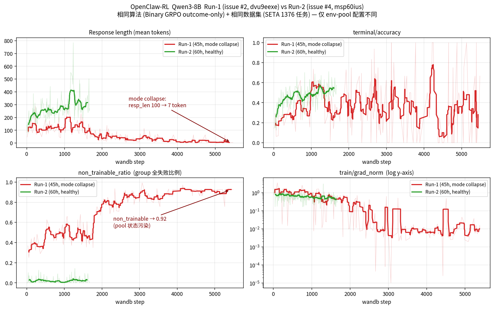
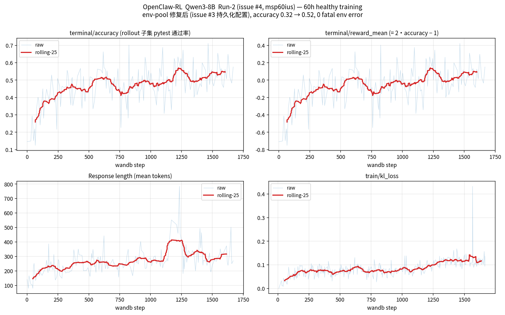
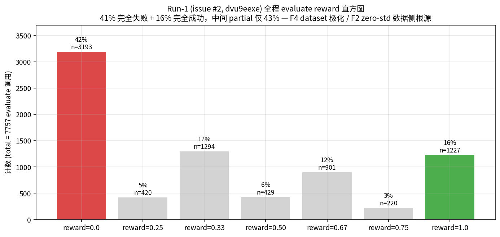
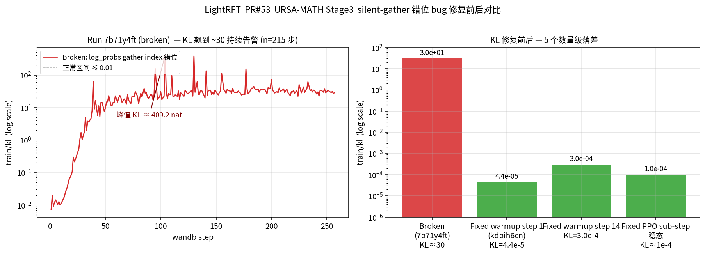
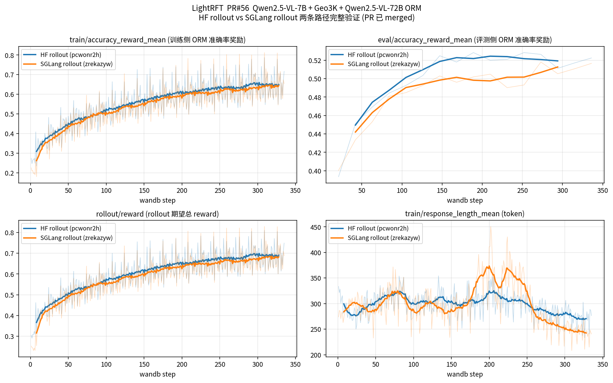

# 双周工作总结（2026-04-17 → 2026-04-30）

> 上次汇报 6 项 TODO 的兑现情况，每项一段 + 核心图/表，所有数据点 / wandb run / issue / PR / paper / 模型权重均给出超链接。

**关联仓库**：[`HansBug/OpenClaw-RL`](https://github.com/HansBug/OpenClaw-RL)（fork from [`Gen-Verse/OpenClaw-RL`](https://github.com/Gen-Verse/OpenClaw-RL)）+ [`opendilab/LightRFT`](https://github.com/opendilab/LightRFT)

**关联 wandb 项目**：
- [`hansbug/openclaw-terminal-rl`](https://wandb.ai/hansbug/openclaw-terminal-rl) — terminal-rl 训练
- [`hansbug/LightRFT-URSA8B-Stage3`](https://wandb.ai/hansbug/LightRFT-URSA8B-Stage3) — URSA-MATH PRM 训练
- [`hansbug/ORM-RL-Demo-QwenVL-7B-Geo3K`](https://wandb.ai/hansbug/ORM-RL-Demo-QwenVL-7B-Geo3K) — Geo3K ORM-RL demo

---

## 0. 进度速览

| # | TODO | 状态 | 主要产出 |
|---:|---|:---:|---|
| 1 | Qwen3-8B SETA terminal-rl 训练 | ✅ | 3 次 run + env-pool 全栈复盘 + 4 个 issue |
| 2 | agentic-rl 探索/利用改进调研 | ✅ | [openclaw-rl#6](https://github.com/HansBug/OpenClaw-RL/issues/6) |
| 5a | LightRFT [PR#53](https://github.com/opendilab/LightRFT/pull/53) PRM 训练 + accuracy debug | 🔄 **仍在 debug** | KL bug 已定位修复 (30→4e-4)；accuracy 不上升真问题、main 冲突、PRM 变体 1、freeze_prefix 修复均待办 |
| 5b | LightRFT [PR#56](https://github.com/opendilab/LightRFT/pull/56) Geo3K ORM-RL demo | ✅ 收尾 (merged) | HF + SGLang 双路径完整验证 |
| 6 | 7B-70B agentic-rl 开源 base 调研 | ✅ TOP3 给出 | [openclaw-rl#6 §3](https://github.com/HansBug/OpenClaw-RL/issues/6) |
| 3 | Harbor + terminus2 + Qwen3-8B benchmark | ❌ 0%（环境基础已就位） | [openclaw-rl#5 Phase 1](https://github.com/HansBug/OpenClaw-RL/issues/5) 待执行 |
| 4 | camel-agent vs terminus2 对比文档 | ❌ 0%（依赖 #3） | [openclaw-rl#5 Phase 2](https://github.com/HansBug/OpenClaw-RL/issues/5) 待执行 |

---

## 1. Qwen3-8B 在 SETA 数据集上的 terminal-rl 训练 ✅

跑了 **3 次完整训练**（4B baseline + 8B 两轮），中间穿插 [`#3`](https://github.com/HansBug/OpenClaw-RL/issues/3) env-pool 全栈复盘。最关键的一次是 **8B run-2 ([`msp60ius`](https://wandb.ai/hansbug/openclaw-terminal-rl/runs/msp60ius))，60h / 565 step / acc 0.32→0.52，未塌缩**，是当前最稳定的 baseline。

| run | issue | 模型 | step | 时长 | wandb | acc 全程均值 | acc 单 batch peak | 末段 resp_len | 末态 |
|---|---|---|---:|---:|---|---:|---:|---:|---|
| 0 | [#1](https://github.com/HansBug/OpenClaw-RL/issues/1) | Qwen3-4B | 270 | 10h | [`lpurziy1`](https://wandb.ai/hansbug/openclaw-terminal-rl/runs/lpurziy1) | 0.345 | 0.60 | 150 | KL drift 主动停 |
| 1 | [#2](https://github.com/HansBug/OpenClaw-RL/issues/2) | Qwen3-8B | 1107 | 45h | [`dvu9eexe`](https://wandb.ai/hansbug/openclaw-terminal-rl/runs/dvu9eexe) | 0.349 | 0.59 | **7** | **完整 mode collapse** |
| 2 | [#4](https://github.com/HansBug/OpenClaw-RL/issues/4) | Qwen3-8B | 565 | 60h | [`msp60ius`](https://wandb.ai/hansbug/openclaw-terminal-rl/runs/msp60ius) | **0.49** | **0.711** | 300+ | 未塌缩 |

### 1.1 Run-1 vs Run-2 对照 — env-pool 修复带来的差异

> **同算法（Binary GRPO outcome-only） + 同数据集（SETA 1376 task）+ 同 base（Qwen3-8B）**，仅 [`#3`](https://github.com/HansBug/OpenClaw-RL/issues/3) 提出的 env-pool 持久化配置（max_tasks 8→64 / max_runs_per_task 4→16 / max_concurrent_closes 10→32 / nofile 1024→65536 / dockerd address pool /16→/12）不同。结果差异：(a) Run-1 的 response_len 在后期从 100 token 单调塌缩到 7 token（红色曲线），Run-2 稳定在 300+（绿色）；(b) Run-1 的 `non_trainable_ratio` 飙到 0.92，Run-2 全程 < 0.03；(c) Run-1 的 `grad_norm` 末段跌到 8e-3（实际停止更新），Run-2 维持 0.5 健康水位。这是 [openclaw-rl#6 issue body §1.2 F1/F2](https://github.com/HansBug/OpenClaw-RL/issues/6) + [issue body 第二条 comment 假设审视](https://github.com/HansBug/OpenClaw-RL/issues/6#issuecomment-4341621165) 的实证根据。

### 1.2 Run-2 健康训练曲线（60h / 565 step）

> Run-2 的核心 4 指标：accuracy 从 0.18 缓步爬到 0.55+（rolling-25），reward_mean 翻正，response_len 稳定在 200-450，KL 全程 < 0.15 健康区间。issue [`#4`](https://github.com/HansBug/OpenClaw-RL/issues/4) §3.4 完整 8 panel 曲线 + §6 dataset 6 类卡顿事件分析。

### 1.3 Run-1 reward 直方图 — F4 dataset 极化的根源

> Run-1 全程 7757 次 evaluate 调用的 reward 直方图：**42% 完全失败 + 16% 完全成功**，中间 partial 仅 43%。env-pool 把失败的 partial 大量筛掉之后，trainable 集合极化为"全过/全挂"两类——这是 issue [`#6 F2 zero-std`](https://github.com/HansBug/OpenClaw-RL/issues/6) 在数据侧的根源。

---

## 2. Agentic-RL 探索/利用相关改进 ✅

[`HansBug/OpenClaw-RL#6`](https://github.com/HansBug/OpenClaw-RL/issues/6) — 一份双向收口 roadmap，含两条独立调研线 + 两条深度 comment：

- **算法侧**（GRPO 内修正）：[DAPO](https://arxiv.org/abs/2503.14476) / [Dr.GRPO](https://arxiv.org/abs/2503.20783) / [Entropy-Mechanism](https://arxiv.org/abs/2505.22617) / [GiGPO](https://arxiv.org/abs/2505.10978) / [RAGEN-StarPO](https://arxiv.org/abs/2504.20073) / [Search-R1](https://arxiv.org/abs/2503.09516) / [ToRL](https://arxiv.org/abs/2503.23383) 等 7 维度 ~20 篇 paper，按"投入产出比 × 直接对症"排 P0/P1/P2
- **探索-RL 侧**（[comment #4343771439](https://github.com/HansBug/OpenClaw-RL/issues/6#issuecomment-4343771439)）：RND 家族（[DRND](https://arxiv.org/abs/2401.09750) / [EIPO](https://arxiv.org/abs/2211.07627) / [SAC-RND](https://arxiv.org/abs/2301.13616) / [RC-GVF](https://arxiv.org/abs/2211.10282)）+ 2025 LLM-curiosity 桥接（[CDE](https://arxiv.org/abs/2509.09675) / [Curiosity-RLHF](https://aclanthology.org/2025.acl-long.1146.pdf) / [CURIO](https://arxiv.org/abs/2504.03206)），给出 5 条 D1-D5 研究方向 + BCS/PCA 监控指标 + 7 张 mermaid 决策图（[opendilab/awesome-exploration-rl](https://github.com/opendilab/awesome-exploration-rl) 引导）
- **假设审视**（[comment #4341621165](https://github.com/HansBug/OpenClaw-RL/issues/6#issuecomment-4341621165)）：用本地 `training_8b.run1.log` 时间序列证明 run-1 塌缩 ~70% 责任在 pool 而非算法 → 提出 **P0-0 决定性验证实验**：从 [`iter_0000279`](https://github.com/HansBug/OpenClaw-RL/issues/4) 续跑到 step 1100+（24-48h），看是否仍塌

**最便宜可立即上的 single best 实验**：CDE-style actor perplexity bonus（[arxiv 2509.09675](https://arxiv.org/abs/2509.09675)），1 天工程量、0 新模型，rollout 已有的 logprob 直接计算。

---

## 5. LightRFT 训练侧两个 PR

### 5.1 PR#53 — URSA-MATH Stage3 PRM 🔄 仍在 debug

[`opendilab/LightRFT#53`](https://github.com/opendilab/LightRFT/pull/53)（state: **OPEN**, mergeable: **CONFLICTING**, review: **CHANGES_REQUESTED**）：核心训练链 Phase 1-7 已 done，但 **accuracy 不上升的真问题还没解决**。本周期 KL=30 这条线索做了一次完整诊断闭环，但只是众多 debug 步骤之一。

**本周期内进展**（仅是阶段性）：silent gather 错位 bug 定位修复（comment chain [4343948369](https://github.com/opendilab/LightRFT/pull/53#issuecomment-4343948369) → [4350355425](https://github.com/opendilab/LightRFT/pull/53#issuecomment-4350355425) → [4350418489](https://github.com/opendilab/LightRFT/pull/53#issuecomment-4350418489)）：

| 阶段 | wandb run | 现象 / 修复 |
|---|---|---|
| 错位前 | [`7b71y4ft`](https://wandb.ai/hansbug/LightRFT-URSA8B-Stage3/runs/7b71y4ft) | `train/kl ≈ 30` 持续告警，疑似 actor 飞天，第一轮诊断怀疑 K3 estimator 几何放大 |
| **真因** | — | `log_probs_from_logits` 把 actor / ref 的 log_prob 从 **vision-token / prompt 头部** 取出，而非生成 token 位置 — 整套观察都建在 misaligned gather 上 |
| 修复 sub-project | [`kdpih6cn`](https://wandb.ai/hansbug/LightRFT-URSA8B-MathPRM-MisalignFix/runs/kdpih6cn) | warmup 期 `train/kl` 4.4e-5 ~ 3.0e-4 |
| 修复正式项目 | [`6ot0ho7o`](https://wandb.ai/hansbug/LightRFT-URSA8B-Stage3/runs/6ot0ho7o) | 切回 `.env` 配置的正确 project，长训练已启动 |

> 左图：broken run 7b71y4ft 的 215 步 KL 单调爬到 ~30 nat 持续告警（log scale，峰值 409 nat）。右图：修复前后 KL 5 个数量级落差对照（30 → 1e-4）。

**核心未解决问题：accuracy 训练中不上升**。怀疑根因在 stage3 原始实现里"汇总到一个最终 outcome-reward"的 **dataset 位置对齐**部分。下一步按顺序：
1. 把 PRM 这边 reviewer 标过的修改建议点一遍 resolve
2. 解决 PR#53 与 main 的冲突（当前 mergeable=CONFLICTING）
3. 先实现 **PRM 变体 1**（最小改动版）
4. **再回头 debug accuracy 不上升的问题** — 重点查 dataset 位置对齐
5. follow-up：`freeze_prefix` 三层覆盖小 bug

### 5.2 PR#56 — Qwen2.5-VL-7B + Geo3K + Qwen2.5-VL-72B ORM Demo ✅ 收尾

[`opendilab/LightRFT#56`](https://github.com/opendilab/LightRFT/pull/56)（state: **MERGED** @ 2026-04-29）：最小化的端到端 ORM-RL demo 实验，专门让 ORM RL workflow 容易理解、运行、debug。两条 rollout 路径完整长训验证后已收尾合入 main：

| Rollout 后端 | wandb run | 配置 |
|---|---|---|
| HF rollout | [`pcwonr2h`](https://wandb.ai/hansbug/ORM-RL-Demo-QwenVL-7B-Geo3K/runs/pcwonr2h) | `ORM-RL-Demo-Geo3K-General-04161630` (2 GPU) |
| SGLang rollout | [`zrekazyw`](https://wandb.ai/hansbug/ORM-RL-Demo-QwenVL-7B-Geo3K/runs/zrekazyw) | `ORM-RL-Demo-Geo3K-General-SGLang-20260417_150451` |

> 4 panel：train/eval 的 accuracy_reward_mean、rollout/reward、response_length。两条路径独立训练曲线收敛到相近的 reward 水位（train acc reward ~0.65，eval acc reward ~0.55），证明 PR#56 的 demo 在两个 rollout 后端下都能正确跑通 ORM-RL 学习。响应长度上 HF rollout 略稳定（350 token 区间），SGLang 后期开始下行。

---

## 6. 7B-70B 开源 agentic-RL base 模型调研 ✅

[`openclaw-rl#6 §3`](https://github.com/HansBug/OpenClaw-RL/issues/6) 完整覆盖 21 个候选（Qwen3 / Llama / DeepSeek / GLM / Mistral / Hermes / xLAM / Phi / Granite / InternLM / Cohere / Kimi / OpenHands-LM 全家族），按 8×H200 (143 GB) 训练上限筛选：

| 排名 | 模型 | 选它的理由 |
|---|---|---|
| 🥇 | [`Qwen/Qwen3-Coder-30B-A3B-Instruct`](https://huggingface.co/Qwen/Qwen3-Coder-30B-A3B-Instruct) | active 3B 让 GRPO rollout 速度是 dense-32B 的 3-4×；同生态零迁移；Apache 2.0；256k ctx |
| 🥈 | [`mistralai/Devstral-Small-2507`](https://huggingface.co/mistralai/Devstral-Small-2507) | 24B dense，**SWE-Verified ~53**（24B 中第一）；专为 [OpenHands](https://github.com/All-Hands-AI/OpenHands) / SWE-agent multi-turn shell loop SFT |
| 🥉 | [`THUDM/GLM-Z1-32B-0414`](https://huggingface.co/THUDM/GLM-Z1-32B-0414) / [`all-hands/openhands-lm-32b-v0.1`](https://huggingface.co/all-hands/openhands-lm-32b-v0.1) | MIT；与 Qwen 架构兼容 / OpenHands distribution-shift 最小 |
| 上限 | [`zai-org/GLM-4.5-Air`](https://huggingface.co/zai-org/GLM-4.5-Air) | 106B/12A MoE，τ-bench ~70 / BFCL ~78，partial-FT 边界可行 |

**关键 caveat**：切 base 之前必须先做 P0 算法修正（DAPO dynamic sampling + difficulty bucket），否则起点 acc 0.4+ 也会因 group 内 8 sample 大量 reward=1 全过而触发 F2 zero-std 的另一个分支。

---

## 3 + 4. Harbor + terminus2 + camel-agent 对比 ❌ 0% 进度

[`openclaw-rl#5`](https://github.com/HansBug/OpenClaw-RL/issues/5) 把 4 项 TODO 拆成 3 个 Phase + 8 个待决策开放问题，全部 `- [ ]` checkbox 化，方便后续分配执行。

**已就位**：[`terminal-bench 0.2.18`](https://www.tbench.ai) + [`Terminus2`](https://github.com/laude-institute/terminal-bench/tree/main/terminal_bench/agents/terminus_2) 类 + run-2 的 35 个 ckpt（4 个代表性: `iter_0000007 / 0000119 / 0000215 / 0000279`）。

**待执行（Phase 1 baseline）**：
1. 装 [harbor](https://github.com/camel-ai/seta/blob/main/evaluation/terminal_bench_eval/run_eval_tb2.sh) 包（pip 名待 SETA `setup.sh` 确认）
2. 下 [terminal-bench-core v0.1.x](https://www.tbench.ai) 80-task 冻结集
3. 起 Qwen3-8B [vLLM](https://github.com/vllm-project/vllm) / [SGLang](https://github.com/sgl-project/sglang) OpenAI-compat server
4. 跑 base + 4 个 ckpt × 80 task × 3 run = 5 × 240 trial
5. 对照 [terminal-bench leaderboard](https://www.tbench.ai)（GPT-5.5 82.7% / Opus 4.7 69.4% / DeepSeek V4 Pro 67.9%）

**Phase 2**：camel-agent ([`terminal-rl/agent_runner.py`](https://github.com/Gen-Verse/OpenClaw-RL/blob/main/terminal-rl/agent_runner.py)) vs terminus2 静态对比（prompt template / tool schema / context 管理 / max_turns / 错误处理）作为替换决策依据，依赖 Phase 1 数字。

---

## 7. 下期重点

按 ROI 排序：

1. **[openclaw-rl#6 P0-0 假设验证](https://github.com/HansBug/OpenClaw-RL/issues/6#issuecomment-4341621165)**：从 `iter_0000279` 续跑 step 1100+，24-48h，决定算法层重构是否必要
2. **[openclaw-rl#5 Phase 1](https://github.com/HansBug/OpenClaw-RL/issues/5)**：装 harbor + 跑 80-task benchmark，第一次有"对外可比数字"
3. **[CDE actor perplexity bonus](https://arxiv.org/abs/2509.09675)**（D4，1 天工程量）—— 与 P0-0 并行
4. **[LightRFT PR#53](https://github.com/opendilab/LightRFT/pull/53) 继续 debug**：先 resolve reviewer 修改点 + 解 main 冲突 → 实现 PRM 变体 1 → 回头 debug accuracy 不上升 (重点 dataset 位置对齐)
5. **新一轮训练**：根据 P0-0 结果决定继续 Qwen3-8B 还是切 [Qwen3-Coder-30B-A3B](https://huggingface.co/Qwen/Qwen3-Coder-30B-A3B-Instruct)
